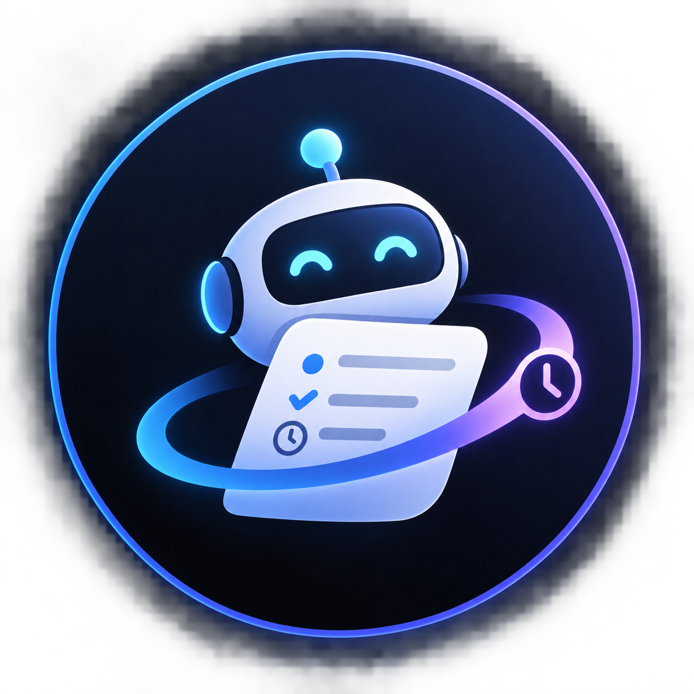

<div align="center">

  

  # ⚡ ChronoDump
  
  **Turn raw audio chaos and messy thoughts into structured plans & auto-armed reminders.**

  *100% Local · Zero Cloud AI Bills · Fully Private & Open-Source*

  [](https://www.python.org/)
  [](https://docs.aiogram.dev/)
  [](https://ollama.com/)
  [](https://github.com/SYSTRAN/faster-whisper)
  [](tests/)
  [](LICENSE)
  [](https://hacktoberfest.com/)

  [✨ Features](#-key-features) • [🏗️ Architecture](#️-system-architecture) • [🚀 Quick Start](#-quick-start-guide) • [🎛️ Slash Commands](#️-slash-command-suite) • [💬 Live Walkthrough](#-live-demo-walkthrough) • [🐳 Production Ops](#-production-deployment--operations) • [🔒 Privacy](#-security--privacy-architecture)

</div>

---

## 💡 Why ChronoDump?

Every day, high-priority tasks and brilliant ideas pop into our heads at the worst possible moments — while driving, walking between meetings, cooking, or right before falling asleep.

Traditional to-do apps demand intense cognitive friction:
```text
Open app ➔ Tap (+) ➔ Type title ➔ Tap date ➔ Pick month ➔ Pick day ➔ Tap time ➔ Pick hour ➔ Pick minute ➔ Configure notification ➔ Save
```
**By step 4, the thought is gone.**

### The ChronoDump Way
1. **Hold Telegram voice note button.**
2. **Dump whatever is in your head in natural speech:**
   > *"Finish reading chapter 4 tonight by 10. Submit final report 3rd Jan. Remind me to drink water in two minutes. And I gotta pick up laundry sometime this weekend."*
3. **Release.**

ChronoDump transcribes the audio locally, extracts the tasks, deterministically resolves every time reference against your timezone, and **automatically arms background reminders in SQLite**. No forms. No date pickers. No cloud AI subscription fees.

---

## ✨ Key Features

| Capability | What It Does | Why It Matters |
|---|---|---|
| 🎙️ **Local-First Audio Ingestion** | Whisper INT8 + Silero Voice Activity Detection (VAD) via `faster-whisper` on CPU | Instant, zero-latency transcription with **zero audio uploaded to the cloud**. Audio is erased immediately after processing. |
| 🧠 **Open-Weight Local Intelligence** | Structured Pydantic parsing powered by Ollama (`qwen2.5:3b` / `qwen3:4b`) | Zero API token costs. 100% data sovereignty. Runs completely offline. |
| ⏱️ **Deterministic Temporal Engine** | Python `datetime` + `zoneinfo` engine parses relative, absolute, and vague timeframes | Eliminates LLM calculation hallucinations. Resolves *"in 2 mins"*, *"tonight by 10"*, *"3rd January"*, and *"next Friday afternoon"*. |
| 🔔 **Autonomous Armed Reminders** | APScheduler service backed by a persistent SQLite jobstore | Reminders survive bot crashes, daemon restarts, and system reboots. |
| 💬 **Executive Telegram Cards** | Custom-engineered ChronoDump Design System with visual hierarchy | Separates clean notes, action items, armed timers, and vague clarification nudges into scannable cards. |
| 🛡️ **Interactive Safety & Undo** | 2-step completion confirmation, 60-second instant undo, and 1-tap snoozing | Never lose a task to an accidental button tap. Push deadlines with `⏳ +30 min` without typing. |
| 🔍 **Vague Deadline Nudging** | Asks for clarification when vague windows approach (e.g., *"sometime this weekend"*) | The bot proactively checks in on Friday at 5:00 PM with simple 1-tap options: `[ Saturday 9 AM ]`, `[ Sunday 9 AM ]`, `[ No rush ]`. |
| 🎛️ **Full Productivity Suite** | Dedicated slash commands: `/today`, `/queue`, `/notes`, `/focus`, `/stats`, `/export`, `/timezone` | Complete task radar, focus sprint timer, and second-brain export at your fingertips. |
| 🚀 **Hardened Production Suite** | 5-phase deployment script, systemd daemon, healthcheck probes, and automated backups | Built for 24/7 reliability on personal laptops, homelabs, or cloud VPS instances. |

---

## 🏗️ System Architecture

```text
                        ┌──────────────────────────────┐
                        │        Telegram User         │
                        │                              │
                        │   🎙️ Voice Note / 💬 Text    │
                        └──────────────┬───────────────┘
                                       │
                                       ▼
                        ┌──────────────────────────────┐
                        │      Single-User Auth Gate   │
                        │      aiogram 3.x Middleware  │
                        └──────────────┬───────────────┘
                                       │
                                       ▼
                        ┌──────────────────────────────┐
                        │       Ingestion Layer        │
                        │                              │
                        │ Audio → ffmpeg 16kHz WAV     │
                        │ Text  → Sanitize & Clean     │
                        └──────────────┬───────────────┘
                                       │
                      Audio            │             Text
                        │              │              │
                        ▼              │              │
             ┌─────────────────────┐   │              │
             │   faster-whisper    │   │              │
             │   base.en + INT8    │   │              │
             │   Silero VAD (CPU)  │   │              │
             └──────────┬──────────┘   │              │
                        │              │              │
         [Wipe Audio] 🗑️│              │              │
                        └───────┬──────┴──────────────┘
                                ▼
                     ┌────────────────────┐
                     │ Raw Transcript/Text│
                     │ + Current DateTime │
                     │ + User Timezone    │
                     └──────────┬─────────┘
                                ▼
                     ┌────────────────────┐
                     │   Ollama / LLM     │
                     │   qwen2.5:3b       │
                     │   Pydantic Schema  │
                     └──────────┬─────────┘
                                │
                         Extracted Dump
                                │
                ┌───────────────┴───────────────┐
                ▼                               ▼
     ┌─────────────────────┐         ┌─────────────────────┐
     │   Summary Engine    │         │   Temporal Engine   │
     │                     │         │  (Pure Python Core) │
     │  • Clean Notes      │         │                     │
     │  • Action Items     │         │  • Relative offsets │
     │  • Executive Quote  │         │  • Contextual times │
     └──────────┬──────────┘         │  • Vague boundaries │
                │                    └──────────┬──────────┘
                │                               │
                ▼                               ▼
     ┌─────────────────────┐         ┌─────────────────────┐
     │  ChronoDump Design  │         │     APScheduler     │
     │  System Telegram    │         │  + SQLite Jobstore  │
     │  Response Card      │         │ (Survives Restarts) │
     └─────────────────────┘         └──────────┬──────────┘
                                                │
                                 ┌──────────────┼──────────────┐
                                 ▼              ▼              ▼
                           Alarm Trigger   Clarification   Snooze Loop
                                 │          Ping (Friday)      │
                                 │              │              │
                                 └──────────────┴──────────────┘
                                                │
                                                ▼
                                    Telegram Interactive Card
                                   [ Done ] [ +30 min ] [ Undo ]
```

---

## 💬 Live Demo Walkthrough

### 1. The Raw Input
You send a single voice note to the bot:
> *"Yo, finish reading chapter 4 tonight by 10. Final report's due 3rd Jan. Remind me to drink water in two minutes. And I gotta pick up laundry sometime this weekend."*

### 2. Immediate Response Card
Within ~2-3 seconds, ChronoDump processes the dump and returns an executive response card:

```text
⚡ CHRONODUMP
━━━━━━━━━━━━━━━━━━━━━━━━━━━━━━━━━━━━━━━━
💬 "Wrap up chapter reading, project deadline tracking, and weekend chores."
━━━━━━━━━━━━━━━━━━━━━━━━━━━━━━━━━━━━━━━━

⏰ ARMED REMINDERS
• 🔔 Tonight @ 10:00 PM — Read Chapter 4
• 🔔 Jan 3, 2027 @ 11:59 PM — Submit Final Report
• 🔔 In 2 minutes — Drink water 🚰

🔍 NEEDS A NUDGE
• ◻️ Pick up laundry
  └─ Clarification scheduled for Friday 5:00 PM: Saturday or Sunday?

━━━━━━━━━━━━━━━━━━━━━━━━━━━━━━━━━━━━━━━━
📊 3 reminders armed · 1 needs nudge · Saved to radar
```

### 3. Autonomous Execution & Action
Two minutes later, without you ever touching an alarm app, ChronoDump pings your Telegram:

```text
⏰ ACTION REQUIRED
━━━━━━━━━━━━━━━━━━━━━━━━━━━━━━━━━━━━━━━━
Drink water 🚰

You scheduled this for right now.

[ ✅ Done ]   [ ⏳ +30 min ]
```

- **Tap `⏳ +30 min`** ➔ Instantly pushes the reminder 30 minutes forward and silently re-arms in SQLite.
- **Tap `✅ Done`** ➔ Triggers a 2-step verification (`[ Confirm ✅ ]` / `[ Cancel ]`) to eliminate accidental taps.
- **Completed Banner** ➔ Shows an active `[ ↩️ Undo ]` button for 60 seconds if you need to restore it.
- **Friday Disambiguation** ➔ When Friday 5:00 PM hits, ChronoDump sends a decision card for laundry: `[ Saturday 9:00 AM ]`, `[ Sunday 9:00 AM ]`, or `[ Keep as Note ]`.

---

## 🎛️ Slash Command Suite

ChronoDump is more than a reminder bot; it is your full second-brain console:

| Command | Description | What It Shows / Does |
|---|---|---|
| `/start` | Welcome & Onboarding | Displays introduction and initial timezone selector |
| `/today` | Daily Radar | Shows all armed reminders for today, pending tasks, and daily note count |
| `/queue` | Reminder Queue | Interactive list of all pending and snoozed reminders with cancel controls |
| `/notes` | Clean Notes Explorer | Recent contextual thoughts, ideas, and observations extracted from voice dumps |
| `/focus` | Focus Sprint Mode | Interactive deep-work countdown timer with quick preset buttons (15m, 25m, 45m, 60m) |
| `/stats` | Productivity Metrics | Lifetime dump count, completed tasks, snooze counts, and completion rate |
| `/export` | Second-Brain Export | Exports all dumps, reminders, and notes as downloadable **Markdown** or **JSON** |
| `/timezone` | Timezone Config | Interactive menu to switch your timezone or input a custom IANA/offset |
| `/help` | Command Directory | Quick reference guide for all bot syntax, voice tips, and shortcuts |

---

## 🚀 Quick Start Guide (< 5 mins)

### 1. Prerequisites
- **Linux, macOS, or Windows (WSL2)**
- **Python 3.12+**
- **ffmpeg** (for audio normalization):
  ```bash
  # Ubuntu/Debian
  sudo apt update && sudo apt install -y ffmpeg

  # macOS
  brew install ffmpeg
  ```
- **Ollama** ([ollama.com](https://ollama.com)):
  ```bash
  # Install Ollama
  curl -fsSL https://ollama.com/install.sh | sh

  # Pull the default open-weight model (Qwen 2.5 3B)
  ollama pull qwen2.5:3b
  ```

### 2. Automated One-Command Setup
Clone the repository and run the setup script:
```bash
git clone https://github.com/GhananilShirpurkar/ChronoDump.git
cd ChronoDump
bash scripts/setup.sh
```

### 3. Configure Secrets (`.env`)
Copy `.env.example` to `.env` and fill in your details:
```bash
cp .env.example .env
nano .env
```

```env
# Telegram Bot Token (from @BotFather)
TELEGRAM_BOT_TOKEN=1234567890:ABCdefGHIjklMNOpqrSTUvwxYZ

# Your personal Telegram User ID (from @userinfobot or @raw_data_bot)
AUTHORIZED_USER_ID=987654321

# Local Ollama settings
OLLAMA_BASE_URL=http://localhost:11434
OLLAMA_MODEL=qwen2.5:3b

# Local Whisper settings
WHISPER_MODEL=base.en
WHISPER_DEVICE=cpu
WHISPER_COMPUTE_TYPE=int8

# Database settings
DATABASE_URL=sqlite:///data/chronodump.db
SCHEDULER_DATABASE_URL=sqlite:///data/chronodump_scheduler.db

# Storage & Timezone defaults
DATA_DIR=./data
DEFAULT_TIMEZONE=UTC
LOG_LEVEL=INFO
```

### 4. Run the Bot
```bash
source .venv/bin/activate
python -m app.main
```
Send `/start` to your bot on Telegram. You're ready to dump your thoughts! 🚀

---

## 🐳 Production Deployment & Operations

ChronoDump is equipped with a comprehensive operations suite designed for zero-downtime maintenance and resilience.

### Option A: Docker Compose (Recommended for Servers)

Run ChronoDump with Ollama in an isolated container stack:
```bash
# Start bot and Ollama services
docker compose up -d --build

# Pull model inside Ollama container on first run:
docker compose exec ollama ollama pull qwen2.5:3b
```

To run with an external host-level Ollama instance, use:
```bash
docker compose -f docker-compose.yml up -d
```

### Option B: Systemd Daemon (Linux Bare-Metal / VPS)

ChronoDump includes a production-ready systemd service file [`chronodump.service`](chronodump.service):
```bash
# 1. Copy service file to systemd directory
sudo cp chronodump.service /etc/systemd/system/

# 2. Edit User, WorkingDirectory, and ExecStart paths
sudo nano /etc/systemd/system/chronodump.service

# 3. Reload and enable service
sudo systemctl daemon-reload
sudo systemctl enable --now chronodump.service

# 4. Inspect live logs
journalctl -u chronodump.service -f
```

---

### 🛠️ Production Operations Toolkit

ChronoDump includes dedicated scripts in [`scripts/`](scripts/) for enterprise-grade management:

#### 1. System Healthcheck Probe
Run deep diagnostics on the database, LLM connectivity, Telegram API, and environment:
```bash
python scripts/healthcheck.py
```
*Output preview:*
```text
⚡ ChronoDump Health Probe
━━━━━━━━━━━━━━━━━━━━━━━━━━━━━━━━━━━━━━━━
✅ Environment: Configured (User: 987654321, Timezone: UTC)
✅ Databases: Connected (App: 48.0 KB, Sched: 16.0 KB)
✅ Ollama LLM: Connected to http://localhost:11434 (Model: qwen2.5:3b ready)
✅ Telegram API: Connected as @chrono_dump_bot
━━━━━━━━━━━━━━━━━━━━━━━━━━━━━━━━━━━━━━━━
🟢 ALL SYSTEMS OPERATIONAL
```

#### 2. Automated Backups
Safely snapshot both SQLite databases with metadata and retention pruning:
```bash
bash scripts/backup.sh
```
*Backups are saved to `data/backups/backup_YYYYMMDD_HHMMSS/`.*

#### 3. 5-Phase Zero-Downtime Deployment
Deploy code updates safely with automated pre-checks, test runs, backups, service restarts, and healthcheck verification:
```bash
bash scripts/deploy.sh
```
*If healthchecks fail post-deploy, run `bash scripts/rollback.sh` for an immediate 1-step rollback.*

---

## 🧪 Testing & Verification

The ChronoDump test suite provides thorough coverage across deterministic time parsing, Pydantic schemas, scheduler recovery, and slash commands.

Run the full pytest suite:
```bash
.venv/bin/pytest -v
```

```text
============================== test session starts ==============================
collected 27 items

tests/test_commands.py::test_today_agenda_query_and_formatting PASSED      [  3%]
tests/test_commands.py::test_queue_pending_and_cancellation PASSED         [  7%]
tests/test_commands.py::test_focus_mode_lifecycle PASSED                   [ 11%]
tests/test_commands.py::test_notes_view_and_export PASSED                  [ 14%]
tests/test_commands.py::test_stats_view PASSED                             [ 18%]
tests/test_handlers.py::test_response_card_formatting_full_sample PASSED   [ 22%]
tests/test_handlers.py::test_response_card_no_deadlines PASSED             [ 25%]
tests/test_handlers.py::test_reminder_alert_message PASSED                 [ 29%]
tests/test_handlers.py::test_keyboards_structure PASSED                    [ 33%]
tests/test_scheduler.py::test_user_creation_and_timezone PASSED            [ 37%]
tests/test_scheduler.py::test_dump_creation PASSED                         [ 40%]
tests/test_scheduler.py::test_reminder_lifecycle_complete_and_undo PASSED   [ 44%]
tests/test_scheduler.py::test_reminder_snooze PASSED                       [ 48%]
tests/test_scheduler.py::test_apscheduler_persistence_and_restart PASSED   [ 51%]
tests/test_schema.py::test_extracted_dump_valid_schema PASSED              [ 55%]
tests/test_schema.py::test_clean_and_parse_json_with_codeblock PASSED      [ 59%]
tests/test_schema.py::test_clean_and_parse_json_raw_string PASSED          [ 62%]
tests/test_temporal.py::test_in_two_minutes PASSED                         [ 66%]
tests/test_temporal.py::test_in_five_minutes_digits PASSED                 [ 70%]
tests/test_temporal.py::test_tonight_by_10 PASSED                          [ 74%]
tests/test_temporal.py::test_tomorrow_morning PASSED                       [ 77%]
tests/test_temporal.py::test_3rd_january PASSED                            [ 81%]
tests/test_temporal.py::test_next_friday PASSED                            [ 85%]
tests/test_temporal.py::test_vague_weekend_clarification PASSED            [ 88%]
tests/test_temporal.py::test_vague_week_clarification PASSED               [ 92%]
tests/test_temporal.py::test_vague_later_today_clarification PASSED        [ 96%]
tests/test_temporal.py::test_validate_and_refine_reminder PASSED           [100%]

============================== 27 passed in 3.73s ==============================
```

---

## 🔒 Security & Privacy Architecture

ChronoDump is architected with strict personal-device security and local-first privacy principles:

1. **Single-User Access Whitelist**:
   - Every incoming Telegram message is filtered by `SingleUserAuthMiddleware`.
   - Any user whose ID does not match `AUTHORIZED_USER_ID` in `.env` is immediately rejected.
2. **Ephemeral Audio Lifespan**:
   - Audio files downloaded from Telegram are converted to 16kHz WAV in memory/temp storage and **purged immediately after transcription**.
   - No audio files linger on your disk.
3. **Zero Third-Party Cloud AI Calls**:
   - Your speech never hits Google, OpenAI, Anthropic, or external cloud speech APIs.
   - Faster-Whisper runs locally on your CPU/GPU.
   - Ollama executes open-weight LLMs locally on your hardware.
4. **Local Database Sovereignty**:
   - All tasks, reminders, and historical dumps are stored in standard SQLite files located in `./data/`. You own your data completely.

---

## 📁 Repository Structure

```text
ChronoDump/
├── assets/
│   └── logo.png               # High-resolution ChronoDump robot icon
├── app/
│   ├── bot/
│   │   ├── design.py          # ChronoDump Design System (dividers, cards, badges)
│   │   ├── handlers.py        # Message, voice, slash command & callback handlers
│   │   ├── keyboards.py       # Inline keyboards (timezone, snooze, done, undo, clarify)
│   │   ├── messages.py        # Response card templates and UI views
│   │   └── middlewares.py     # Single-user security authorization gate
│   ├── ingestion/
│   │   ├── audio.py           # Audio download, ffmpeg normalization, and cleanup
│   │   └── text.py            # Text sanitization and preprocessing
│   ├── intelligence/
│   │   ├── llm.py             # Ollama async client, retry logic, and fallback
│   │   ├── prompts.py         # System, multi-task extraction, and repair prompts
│   │   ├── schema.py          # Pydantic v2 ExtractedDump schema
│   │   └── temporal.py        # Deterministic Python temporal engine
│   ├── scheduler/
│   │   ├── jobs.py            # APScheduler service with SQLite jobstore
│   │   └── reminders.py       # Async alert triggers and reminder notifications
│   ├── storage/
│   │   ├── database.py        # SQLAlchemy session engine and CRUD helpers
│   │   └── models.py          # Models (User, Dump, Reminder, VagueClarification)
│   ├── config.py              # Environment configuration loader
│   └── main.py                # Bot startup and lifecycle entrypoint
├── docs/
│   ├── ARCHITECTURE.md        # System architecture, topology, and data flow specification
│   ├── DEPLOYMENT.md          # Comprehensive production ops and deployment guide
│   ├── PRD.md                 # Full Product Requirements Document (PRD)
│   └── TECHSTACK.md           # Deep dive into technology stack and boundaries
├── scripts/
│   ├── backup.sh              # SQLite snapshot and retention management
│   ├── deploy.sh              # 5-phase zero-downtime deployment runner
│   ├── healthcheck.py         # Diagnostics probe (env, db, ollama, telegram)
│   ├── rollback.sh            # Instant 1-step rollback utility
│   └── setup.sh               # Automated one-command developer setup
├── tests/
│   ├── test_commands.py       # Slash commands (/today, /queue, /focus, /notes, /stats)
│   ├── test_handlers.py       # Response cards, keyboards, and template formats
│   ├── test_scheduler.py      # SQLite persistence, restart recovery, snooze, undo
│   ├── test_schema.py         # Pydantic schema validation & JSON parser tests
│   └── test_temporal.py       # Relative, absolute, and vague time unit tests
├── .dockerignore              # Docker context ignore rules
├── .editorconfig              # Cross-IDE indentation & formatting standards
├── .env.example               # Secrets and configuration template
├── .github/workflows/ci.yml   # Automated GitHub Actions CI workflow
├── ARCHITECTURE.md            # System architecture reference
├── CODEBASE.md                # Codebase map and developer orientation
├── Makefile                   # Production & developer command suite
├── chronodump.service         # Systemd unit service definition
├── docker-compose.yml         # Bot container with host Ollama
├── docker-compose.full.yml    # Full-stack Bot + Ollama Compose stack
├── Dockerfile                 # Container image specification
├── requirements.txt           # Python package dependencies
├── pyproject.toml             # Project metadata and pytest configuration
└── README.md                  # Project documentation
```

---

## 🏆 Hackathon Context

ChronoDump was built for the **Hacktoberfest "Build for a Friend" challenge**. 

The mission was to build a real, usable, private assistant for anyone struggling with ADHD, task paralysis, or busy schedules — replacing cumbersome to-do apps with a zero-friction voice dumping system that handles time resolution and reminder arming autonomously.

---

## 📄 License

This project is licensed under the **MIT License** — see the [LICENSE](LICENSE) file for details.

---

<div align="center">
  <sub>Built with ❤️ and open-source AI by <a href="https://github.com/GhananilShirpurkar">Ghananil Shirpurkar</a>.</sub>
</div>
